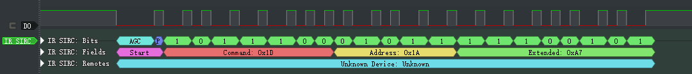
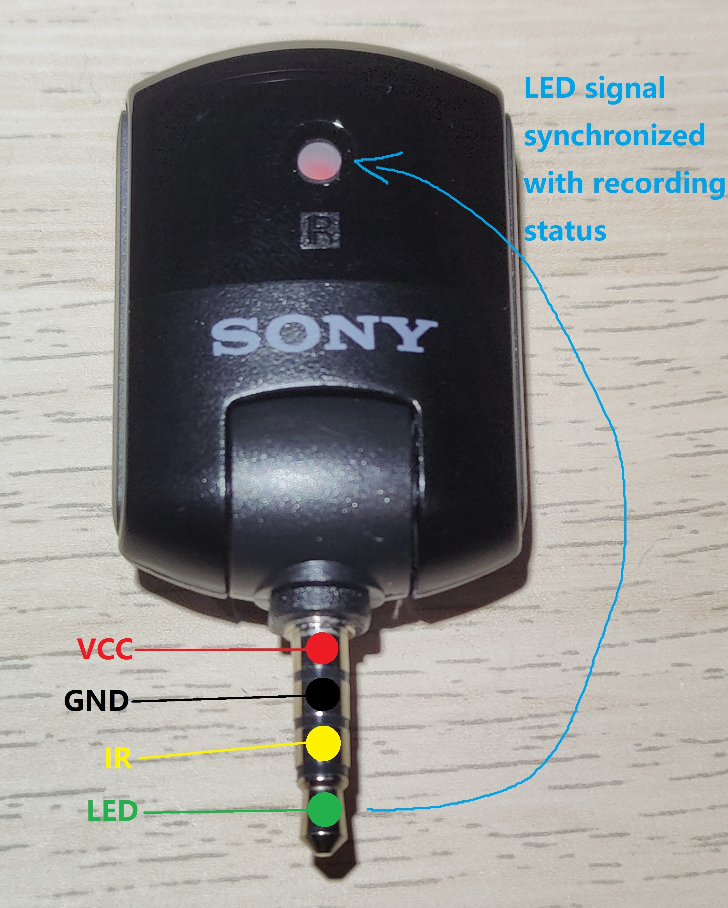

## Sony PCM-D100 Remote Control
Uses [standard 20-bit SIRC protocol](https://www.sbprojects.net/knowledge/ir/sirc.php), but repeats every ~10ms instead of 45ms.

### Device address
- Always 0x1A

### Extended bits
- Carries channel information (press SET + Prev/Play/Next to set to adjust the channel)

|Channel|Code|
|-|-|
|CH1|0xA7|
|CH2|0xAF|
|CH3|0xB7|

### Command bits
- Carries key code

|Key|Code|
|-|-|
|Play|0x1A|
|Pause|0x19|
|Stop|0x18|
|Record|0x1D|
|Previous|0x1B|
|Next|0x1C|
|T-Mark|0x48|

### Example
Record button press on channel CH1

## Remote socket pinout

Standard 3.5mm 4-pole mini jack

|Segment|Usage|Remark|
|-|-|-|
|Tip|Record LED indicator signal|Active low. Flashing when record paused, light up when recording is in progress.|
|Ring close to tip|IR signal||
|Ring close to sleeve|Ground||
|Sleeve|Power for IR receiver|DC3V|

